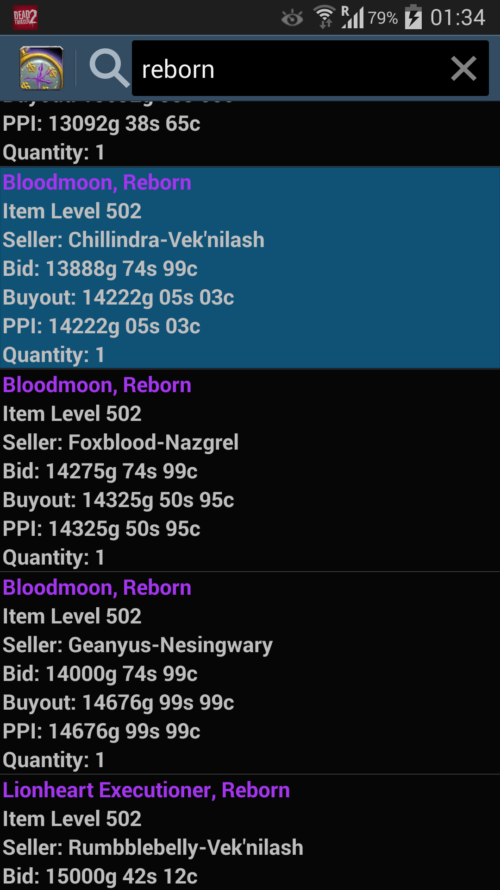
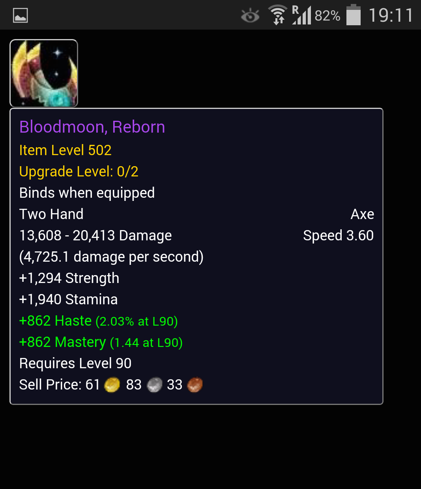
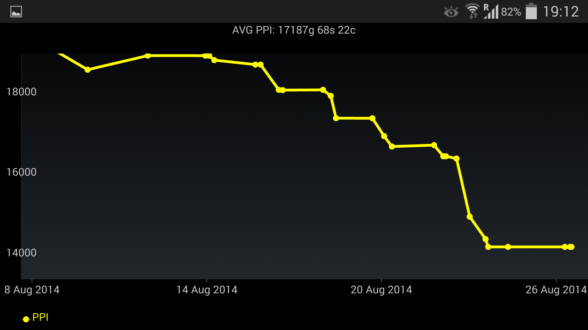
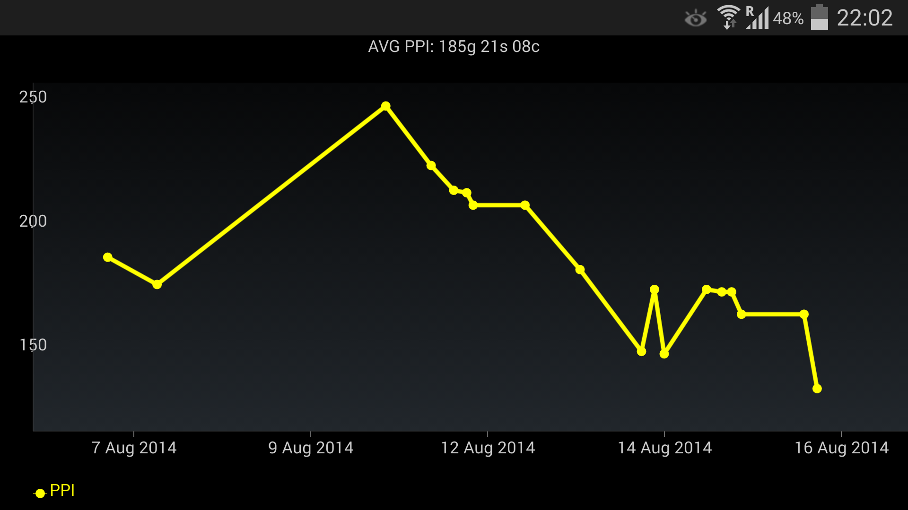
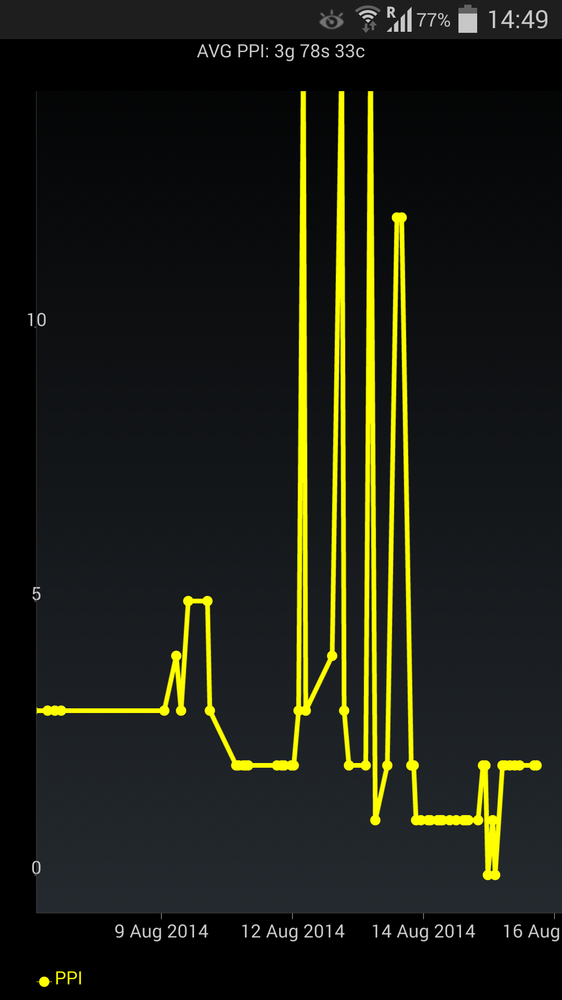
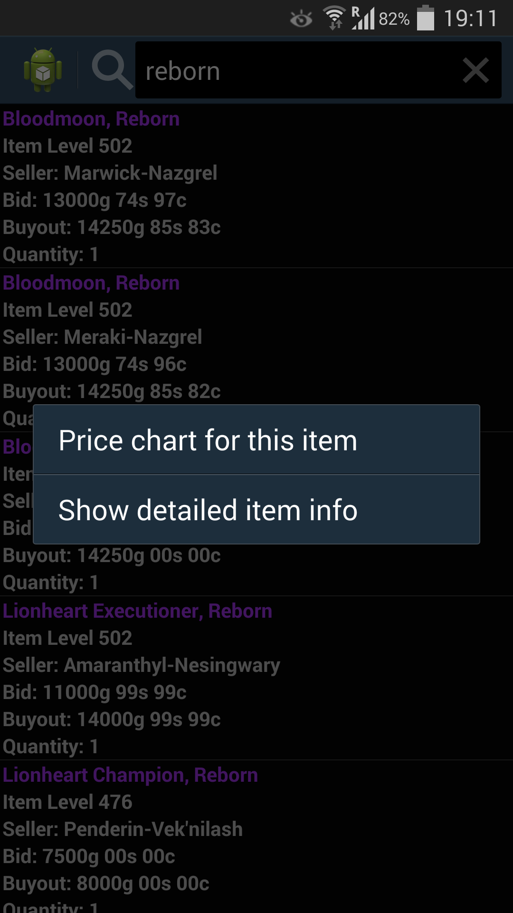

Android client to the https://github.com/sbenner/wowauctions-server.

Using patched https://code.google.com/p/achartengine/
from here https://code.google.com/p/achartengine/issues/detail?id=57#makechanges

